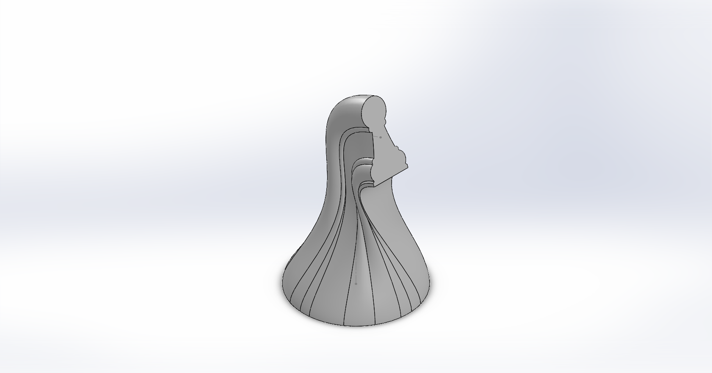

# Ajedrez 3D en SolidWorks ♟️

Este proyecto contiene el diseño de un conjunto de piezas de ajedrez modeladas en **SolidWorks** y listas para impresión 3D en formato **STL**.

## 📂 Estructura del proyecto

- `modelos/` → Archivos fuente en SolidWorks (`.SLDPRT`)
- `stl/` → Archivos exportados a formato STL listos para impresión
- `docs/` → Imágenes de referencia, renders o documentación adicional

## 🖨️ Impresión 3D

Los archivos en `stl/` pueden cargarse directamente en tu slicer favorito (Cura, PrusaSlicer, etc.).  

## 🚧 Estado del proyecto

Actualmente el set está **incompleto**. Faltan piezas como el alfil, caballo, reina y rey.  
Si deseas contribuir con más piezas o mejoras, ¡eres bienvenido! 🎉

## 📸 Vista previa

## 📜 Licencia
Este proyecto se distribuye bajo la licencia [CC-BY-SA 4.0](https://creativecommons.org/licenses/by-sa/4.0/deed.es).

